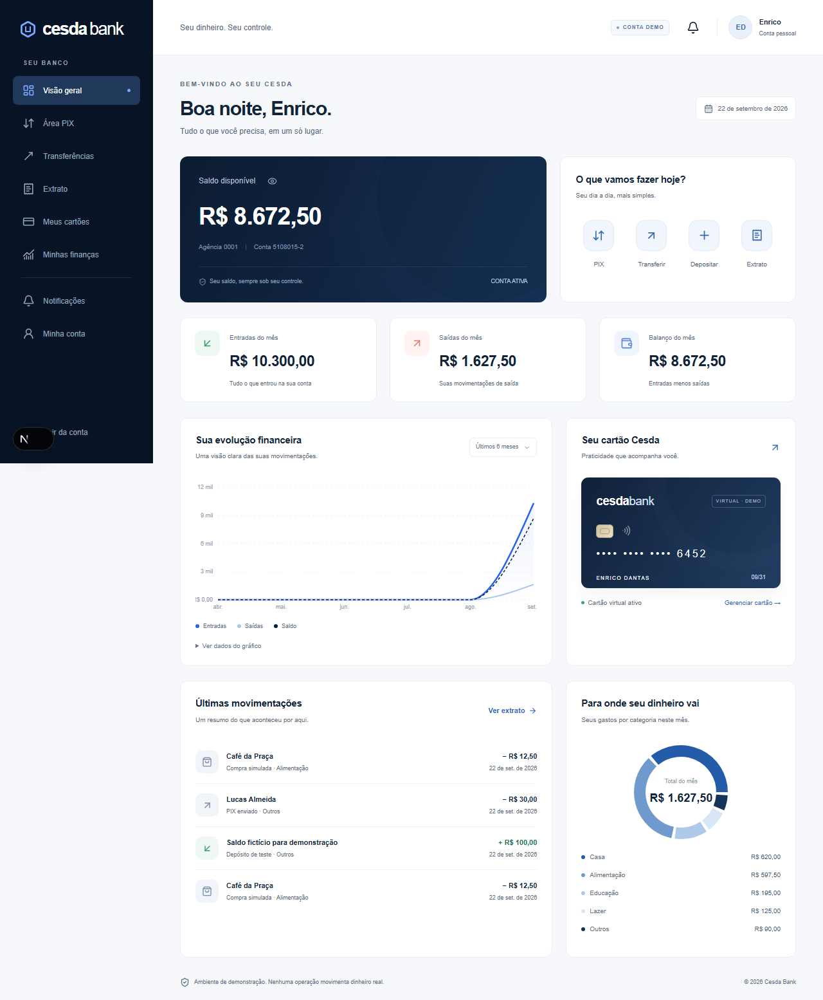
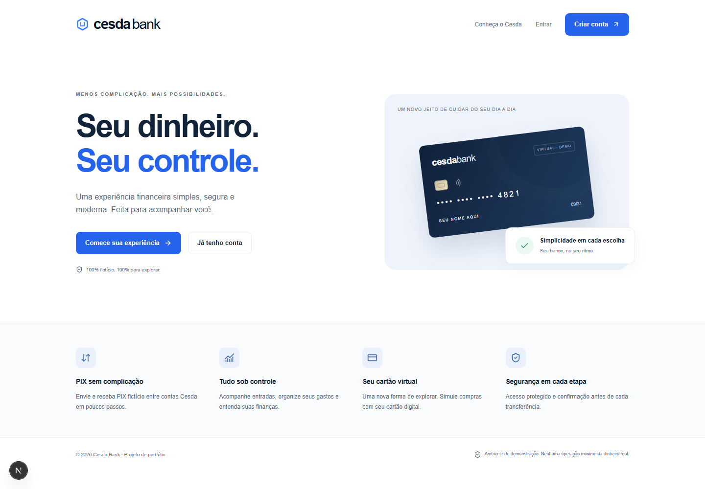
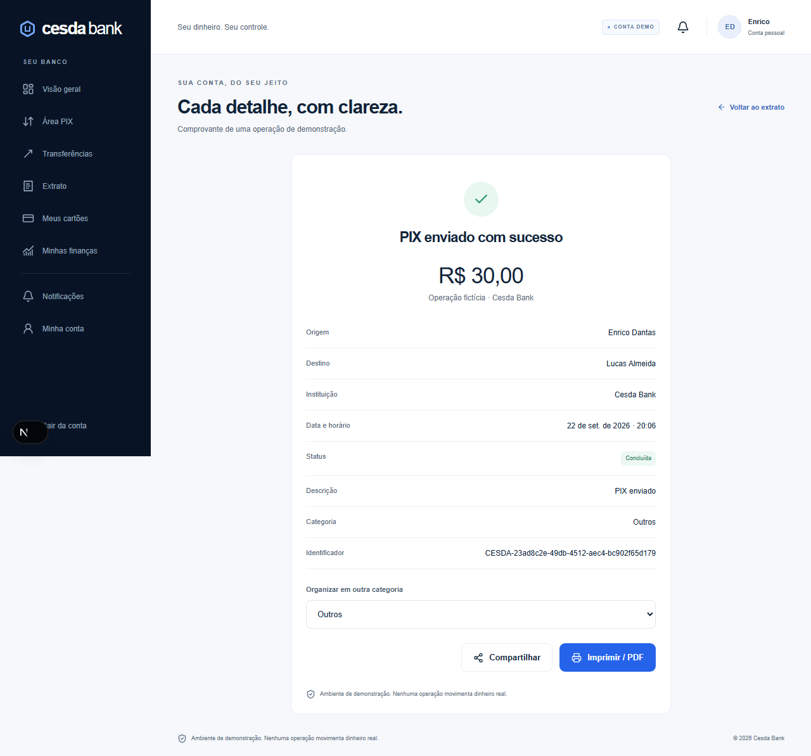
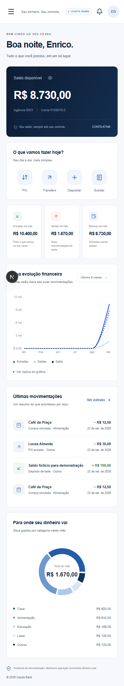
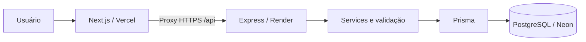

# Cesda Bank

**Seu dinheiro. Seu controle.**

Banco digital fictício desenvolvido para portfólio, com frontend Next.js e API Express independentes. Cadastro, autenticação, PIX entre usuários, saldo de teste, cartão virtual, extrato, gráficos e administração em uma interface responsiva em português.

> Todas as operações são simuladas. Não há movimentação de dinheiro real, PIX real ou integração com meios de pagamento. Use somente dados fictícios.



## Funcionalidades

- Cadastro com conta automática e saldo zero.
- Login, refresh rotativo e logout com revogação de sessão.
- Depósito de demonstração e histórico de operações.
- Chaves PIX próprias, busca de destinatário, confirmação e comprovante.
- Transferência ACID, proteção de concorrência e idempotência.
- Extrato paginado com busca, direção, tipo, categoria e intervalo de datas.
- Comprovantes com impressão/PDF e compartilhamento pelo navegador.
- Resumo mensal, evolução em seis meses e distribuição de gastos.
- Cartão virtual fictício, bloqueio e simulação de compras.
- Perfil com dados mascarados e notificações.
- Administração de usuários/contas, bloqueio auditável e consulta de eventos.

## Interface

| Página pública                     | Comprovante                                      |
| ---------------------------------- | ------------------------------------------------ |
|  |  |

<details>
<summary>Dashboard no celular</summary>



</details>

## Tecnologias

| Camada      | Stack                                                                                   |
| ----------- | --------------------------------------------------------------------------------------- |
| Frontend    | Next.js 16, React 19, TypeScript strict, Tailwind CSS 4, Recharts, React Hook Form, Zod |
| API         | Node.js, Express 5, TypeScript strict, Zod                                              |
| Dados       | PostgreSQL, Prisma 7, adapter-pg, migrations SQL                                        |
| Segurança   | Argon2id, JWT, cookies HTTP-only, Helmet, CORS, rate limiting, auditoria                |
| Qualidade   | ESLint, Prettier, Vitest, Supertest, Playwright, axe-core                               |
| Implantação | Vercel, Render, Neon, GitHub Actions                                                    |

O lockfile fixa a árvore de dependências. Overrides de deepmerge-ts e mysql2 substituem versões transitivas vulneráveis do CLI Prisma, com geração, migrations e testes verificados.

## Arquitetura



O proxy do Next mantém a API na mesma origem do navegador. O Express continua sendo uma aplicação separada, com regras financeiras e autorização exclusivamente no backend.

```text
frontend/
  src/app/               páginas públicas e privadas
  src/components/        navegação, formulários, cartões e gráficos
  src/features/          auth, dashboard, PIX, extrato, cartões, perfil, admin
  src/hooks/             carregamento de dados
  src/services/          cliente HTTP e renovação de sessão
  src/types/             contratos do frontend
  src/utils/             formatação brasileira e entrada monetária
backend/
  prisma/                schema, migrations e seed
  src/config/            ambiente, banco, logs e OpenAPI
  src/controllers/       adaptação HTTP da autenticação
  src/middlewares/       autenticação, origem, roles e erros
  src/routes/            endpoints e limites por operação
  src/services/          regras de negócio
  src/repositories/      seleções seguras e acesso de usuário
  src/validators/        schemas Zod
  src/utils/             erros e valores financeiros
  tests/                 testes unitários e integração PostgreSQL
e2e/                     testes de navegador
docs/                    screenshots, segurança e deploy
scripts/                 configuração e PostgreSQL local
```

## Requisitos

- Node.js 22.12+ (desenvolvido e testado com Node.js 24).
- npm.
- PostgreSQL 17+ via Docker, instalação própria ou Neon.
- Para testes de navegador: Chromium instalado pelo Playwright.

## Instalação local

Na raiz do projeto:

```bash
npm ci
npm run setup:env
npm run db:generate
```

setup:env cria backend/.env e frontend/.env.local apenas se não existirem, com segredos aleatórios e senha de seed exclusiva da instalação. Arquivos de ambiente estão ignorados pelo Git.

### Banco com Docker

```bash
docker compose up -d
npm run db:migrate
npm run db:seed
npm run dev
```

### Alternativa sem Docker

Em um terminal:

```bash
npm run db:local
```

Em outro:

```bash
npm run db:migrate
npm run db:seed
npm run dev
```

A ferramenta local inicia um PostgreSQL completo em 127.0.0.1:5432, com dados persistidos em .local/postgres. Não a use junto com outro banco que já ocupe essa porta. Ctrl+C encerra o processo sem apagar os dados. Essa alternativa depende do pacote embedded-postgres e não faz parte do deploy.

- Aplicação: http://localhost:3000
- API: http://localhost:4000/api
- Swagger (com a sessão do navegador): http://localhost:3000/api/docs/
- OpenAPI: http://localhost:4000/api/openapi.json
- Saúde: http://localhost:4000/api/health

No PowerShell, se a política local bloquear npm.ps1, use npm.cmd nos mesmos comandos.

## Contas de demonstração

| Nome          | E-mail                 | Papel |
| ------------- | ---------------------- | ----- |
| Enrico Dantas | enrico@cesdabank.local | USER  |
| Lucas Almeida | lucas@cesdabank.local  | USER  |
| Marina Costa  | marina@cesdabank.local | USER  |
| Admin Cesda   | admin@cesdabank.local  | ADMIN |

A senha está no valor SEED_PASSWORD do arquivo privado backend/.env. Ela não fica no código nem nesta documentação. Enrico começa com R$ 8.500,00: depósito de R$ 10.000,00 e cinco compras fictícias, todos registrados no extrato. Outros usuários do seed recebem R$ 10.000,00 para testes. Novos cadastros comuns recebem zero.

As chaves PIX de e-mail já são cadastradas pelo seed. Experimente enviar um PIX para lucas@cesdabank.local. O seed preserva usuários já existentes; executá-lo novamente não restaura saldos nem sobrescreve senhas.

## Variáveis de ambiente

| Variável            | Onde              | Descrição                                       |
| ------------------- | ----------------- | ----------------------------------------------- |
| DATABASE_URL        | Backend           | URL privada PostgreSQL; TLS no Neon             |
| JWT_SECRET          | Backend           | Chave aleatória de access token, 32+ caracteres |
| JWT_REFRESH_SECRET  | Backend           | Chave diferente, aleatória, 32+ caracteres      |
| FRONTEND_URL        | Backend           | Origem autorizada, ex.: http://localhost:3000   |
| NODE_ENV            | Backend           | development, test ou production                 |
| PORT                | Backend           | 4000 local; porta do provedor em produção       |
| SEED_PASSWORD       | Seed              | Senha forte dos usuários demonstrativos         |
| NEXT_PUBLIC_API_URL | Frontend          | /api                                            |
| API_INTERNAL_URL    | Frontend servidor | http://localhost:4000 ou URL HTTPS do Render    |
| TEST_DATABASE_URL   | Testes            | PostgreSQL exclusivo com nome cesda_test        |

Consulte backend/.env.example e frontend/.env.example. Nenhum segredo deve receber o prefixo NEXT_PUBLIC_.

## Testes e qualidade

Prepare um banco separado (nunca use o banco demonstrativo para testes):

```bash
npm run db:prepare-test
npm run lint
npm run typecheck
npm test
npm run build
```

Os testes de integração exigem o nome cesda_test e fazem TRUNCATE nesse banco a cada caso. A CI fornece PostgreSQL 17 próprio e aplica as migrations antes da suíte.

Os testes verificam:

- R$ 1.000 na conta A, PIX de R$ 300, saldo final de R$ 700 e crédito de R$ 300 na conta B.
- Falha injetada após débito: rollback preserva os saldos e não grava transferência parcial.
- Saldo insuficiente, conta/chave inexistente, bloqueios, auto transferência e limite diário.
- Operações concorrentes e idempotência concorrente.
- Cadastro, hash, cookies, proteção de rotas, autorização administrativa, isolamento entre usuários, refresh e logout.

Com frontend e API em execução e seed aplicado:

```bash
npx playwright install chromium
npm run test:e2e
node scripts/a11y-audit.mjs
```

Playwright testa os fluxos integrados e larguras de 360, 390, 768, 1024 e 1440 px. Os testes de navegador criam operações fictícias no banco demonstrativo; não restauram o saldo inicial do seed. Relatórios ficam em playwright-report e test-results. Screenshots revisadas ficam em docs/screenshots.

## API REST

Respostas de sucesso usam `{ "success": true, "data": ... }`. Erros usam `{ "success": false, "error": { "code": "...", "message": "..." } }`. Exclusões/logout retornam 204 sem corpo.

| Grupo        | Rotas                                                                                          |
| ------------ | ---------------------------------------------------------------------------------------------- |
| Auth         | POST /auth/register, /login, /logout, /refresh; GET /auth/me                                   |
| Conta        | GET /account, /account/balance; POST /account/demo-deposit                                     |
| PIX          | GET/POST /pix/keys; DELETE /pix/keys/:id; GET /pix/search/:key; POST /pix/transfer             |
| Extrato      | GET /transactions, /transactions/:id; PATCH /transactions/:id/category                         |
| Dashboard    | GET /dashboard/summary, /monthly, /categories                                                  |
| Cartões      | GET/POST /cards; PATCH /cards/:id/block, /unblock                                              |
| Compras      | POST /purchases/simulate                                                                       |
| Notificações | GET /notifications; PATCH /notifications/:id/read, /read-all                                   |
| Perfil       | GET/PATCH /profile                                                                             |
| Admin        | GET /admin/summary, /users, /accounts, /transactions, /audit; PATCH /admin/accounts/:id/status |

Todas as rotas têm prefixo /api. Extrato e administração aceitam page e limit, com máximo de 100 itens. Extrato aceita filter, search, category, from e to. As mutações exigem Origin autorizado e X-Cesda-Client: web.

PIX, depósitos e compras exigem Idempotency-Key com UUID. Reenvie a mesma chave e corpo para repetir uma tentativa; não gere outra chave em um retry da mesma operação.

Exemplo de corpo de PIX:

Primeiro consulte `/pix/search/:key`. Envie o `pixKeyId` retornado junto da confirmação: se a chave for excluída e cadastrada novamente, o backend exige uma nova consulta antes de movimentar o saldo.

```json
{
  "key": "lucas@cesdabank.local",
  "pixKeyId": "11111111-1111-4111-8111-111111111111",
  "amount": 30000,
  "description": "Transferência de demonstração"
}
```

amount=30000 representa R$ 300,00. Detalhes dos contratos estão no Swagger.

## Segurança e deploy

Veja [Segurança e integridade](docs/SECURITY.md) e [Deploy Neon + Render + Vercel](docs/DEPLOY.md).

O projeto inclui render.yaml, configuração Vercel e CI para lint, typecheck, testes e build. A implantação externa depende de repositório e contas dos provedores; não é feita automaticamente.

Recuperação de senha por e-mail e MFA não estão habilitados. O link de recuperação explica a limitação. O rate limiter é de uma instância; antes de escalar, substitua-o por armazenamento compartilhado. O projeto é uma demonstração técnica e não um sistema autorizado para operar dinheiro real.
